# 📝 Relatório Técnico: Caracterizando a Atividade de Code Review no GitHub

## 1. Informações do grupo

- **🎓 Curso:** Engenharia de Software
- **📘 Disciplina:** Laboratório de Experimentação de Software
- **🗓 Período:** 6° Período
- **👨‍🏫 Professor(a):** Prof. Dr. João Paulo Carneiro Aramuni
- **👥 Membros do Grupo:** Ana Luiza Machado Alves, Lucas Henrique Chaves de Barros, Raquel Inez de Almeida Calazans

---

## 2. Introdução

O laboratório tem como objetivo analisar a atividade de code review desenvolvida em repositórios populares do GitHub, identificando variáveis que influenciam no merge de um PR, sob a perspectiva de desenvolvedores que submetem código aos repositórios selecionados.

### 2.1. Questões de Pesquisa (Research Questions – RQs)

As **Questões de Pesquisa** foram definidas para guiar a investigação e estruturar a análise dos dados coletados:

#### 1. Feedback Final das Revisões (Status do PR):

| RQ       | Pergunta                                                                         |
| -------- | -------------------------------------------------------------------------------- |
| **RQ01** | Qual a relação entre o tamanho dos PRs e o feedback final das revisões?          |
| **RQ02** | Qual a relação entre o tempo de análise dos PRs e o feedback final das revisões? |
| **RQ03** | Qual a relação entre a descrição dos PRs e o feedback final das revisões?        |
| **RQ04** | Qual a relação entre as interações nos PRs e o feedback final das revisões?      |

#### 2. Número de Revisões:

| RQ          | Pergunta                                                                      |
| ----------- | ----------------------------------------------------------------------------- |
| **RQ05**    | Qual a relação entre o tamanho dos PRs e o número de revisões realizadas?     |
| **RQ06**    | Qual a relação entre o tempo de análise dos PRs e o número de revisões        |
| realizadas? |
| **RQ07**    | Qual a relação entre a descrição dos PRs e o número de revisões realizadas?   |
| **RQ08**    | Qual a relação entre as interações nos PRs e o número de revisões realizadas? |

### 2.2. Hipóteses Informais (Informal Hypotheses – IH)

As **Hipóteses Informais** foram elaboradas a partir das RQs, estabelecendo expectativas sobre os resultados esperados do estudo:

#### 1. Feedback Final das Revisões (Status do PR)

| IH   | Descrição                                                                                                                                                                                             |
| ---- | ----------------------------------------------------------------------------------------------------------------------------------------------------------------------------------------------------- |
| IH01 | Pull requests maiores tendem a ter menor chance de aprovação, pois aumentam a complexidade da revisão e a probabilidade de conter erros.                                                              |
| IH02 | Quanto maior o tempo de análise de um PR, maior a chance de ele ser rejeitado ou abandonado, indicando dificuldades ou falta de consenso durante a revisão.                                           |
| IH03 | PRs com descrições detalhadas têm mais chance de aprovação, porque facilitam a compreensão das mudanças pelos revisores.                                                                              |
| IH04 | PRs com mais interações (comentários, discussões) tendem a ter maior chance de aprovação, pois mostram engajamento e refinamento colaborativo, embora discussões excessivas possam indicar conflitos. |

#### 2. Número de Revisões:

| IH   | Descrição                                                                                                                            |
| ---- | ------------------------------------------------------------------------------------------------------------------------------------ |
| IH01 | PRs maiores exigem mais rodadas de revisão, porque os revisores precisam verificar múltiplos pontos do código.                       |
| IH02 | PRs analisados por longos períodos tendem a passar por mais revisões, já que mais tempo abre espaço para mais iterações e ajustes.   |
| IH03 | PRs com descrições claras reduzem o número de revisões necessárias, pois os revisores entendem melhor o propósito das mudanças.      |
| IH04 | Quanto mais interações houver em um PR, maior o número de revisões realizadas, refletindo um processo mais iterativo e colaborativo. |

---

## 3. Tecnologias e ferramentas utilizadas

- **💻 Linguagem de Programação:** Python 3.x
- **🛠 Frameworks/Bibliotecas:** GraphQL
- **🌐 APIs utilizadas:** GitHub GraphQL API
- **📦 Dependências:** `pandas`, `matplotlib`, `seaborn`, `gitpython`, `requests`, `keyring`, `tqdm`

---

## 4. Metodologia

O experimento seguiu as etapas abaixo para garantir uma análise robusta dos dados de code review:

### 4.1. Coleta de Dados

Utilizamos a GitHub API para extrair informações de PRs de repositórios populares, priorizando diversidade de linguagens e atividade recente. Foram coletados dados brutos sobre tamanho, tempo de análise, descrição, interações, status do PR, número de revisões e métricas adicionais dos repositórios.

Foram considerados os **top 200 repositórios** mais populares, selecionados a partir dos seguintes critérios:

- **Popularidade** → repositórios com maior número de estrelas (top-N).
- **Atividade mínima de PRs** → presença de ao menos 100 PRs (MERGED+CLOSED).
- **Atividade de Code Review** → PRs que tenham passado pelo processo de code review que possuam status MERGED ou CLOSED e que possuam ao menos **uma revisão**.

Definição das `queries`:

- **Query `TopRepositories`:**
  Lista os repositórios mais populares (ordenados por estrelas) com informações básicas sobre cada um.

  - Nome do repositório
  - Usuário ou organização proprietária
  - Linguagem principal do código
  - Quantidade total de estrelas
  - Quantidade total de forks
  - Quantidade de releases publicadas
  - Total de PRs (estados MERGED e CLOSED)

- **Query `PullRequests`:**
  Coleta informações detalhadas sobre pull requests de um repositório específico.
  - Número, título e autor do PR
  - Datas de criação, fechamento e merge
  - Booleano indicando se foi mergeado
  - Métricas de mudança no código (tamanho do PR)
  - Texto da descrição do PR
  - Número total de comentários no PR
  - Quantidade de threads de revisão
  - Número de participantes envolvidos
  - Número total de revisões
  - Estado final do PR (MERGED ou CLOSED)

#### 4.1.1. Variáveis Analisadas

Para responder às questões de pesquisa, definimos as seguintes variáveis:

**Variáveis Independentes:**

- **Tamanho do PR** (`pr_size`): Soma de linhas adicionadas e removidas (additions + deletions)
- **Tempo de Análise** (`analysis_time_hours`): Tempo em horas entre a criação e o fechamento/merge do PR
- **Tamanho da Descrição** (`description_length`): Número de caracteres no corpo (body) do PR
- **Interações** (`interactions`): Número total de comentários e discussões no PR

**Variáveis Dependentes:**

- **Status do PR** (`is_mergeado`): Variável binária (1 = mergeado, 0 = fechado sem merge)
- **Número de Revisões** (`num_reviews`): Contagem de revisões formais realizadas

#### 4.1.2. Método Estatístico

Utilizamos o **Coeficiente de Correlação de Spearman (ρ)** para todas as análises. Esta escolha se justifica por três razões principais:

1. **Não-parametricidade:** Não assume distribuição normal dos dados, adequado para dados de repositórios que tipicamente apresentam distribuições assimétricas (long-tail)
2. **Robustez a outliers:** Menos sensível a valores extremos, comuns em métricas de software (PRs muito grandes ou muito longos)
3. **Medição de relações monotônicas:** Captura relações que não são necessariamente lineares, mas seguem uma tendência consistente de aumento ou diminuição

**Interpretação dos valores de correlação:**

- ρ próximo de 0: correlação fraca/inexistente
- 0.1 ≤ |ρ| < 0.3: correlação fraca
- 0.3 ≤ |ρ| < 0.5: correlação moderada
- |ρ| ≥ 0.5: correlação forte

**Significância estatística:**

- Utilizamos α = 0.05 como limiar de significância
- Com n = 947.735, virtualmente todas as correlações são estatisticamente significantes
- Portanto, focamos na **magnitude prática** das correlações, não apenas na significância estatística

#### 4.1.3. Análise Descritiva

Para cada variável, calculamos estatísticas descritivas separadas para:

- PRs mergeados (aceitos)
- PRs não mergeados (rejeitados/fechados)
- Conjunto geral de dados

As principais métricas reportadas são:

- **Mediana:** Valor central da distribuição, robusto a outliers
- **Média:** Valor médio, sensível a outliers mas útil para comparação
- **Desvio padrão:** Medida de dispersão dos dados
- **Mínimo e máximo:** Limites dos valores observados

### 4.2. Filtragem e Paginação

Aplicamos filtros para remover repositórios arquivados, descontinuados ou sem contribuições externas relevantes. Utilizamos paginação para contornar limites da API e garantir a completude dos dados.

- Devido ao limite de requisições da GitHub API, a coleta exigiu o uso de uma paginação de **20 repositórios** e **50 pull requests** por página, permitindo recuperar lotes sucessivos de dados sem perda de registros.
- Foram aplicados filtros para garantir consistência, tais como:
  - Exclusão de repositórios **arquivados ou descontinuados**.
  - Exclusão de repositórios **sem contribuições externas significativas**.
  - Tratamento de **valores nulos ou incompletos** em campos relevantes (ex.: releases ou issues).
- Para maior confiabilidade, foi implementado um sistema de retry com backoff exponencial para lidar com erros temporários ou rate limiting da API.
- ⏱ O tempo médio estimado de coleta foi de aproximadamente **72 horas** para o conjunto completo de repositórios (com todos os PRs).

### 4.3. Normalização e Pré-processamento

Após a coleta, os dados foram organizados em um banco/tabulação unificada, estruturada por repositório.
Foram aplicadas etapas de pré-processamento:

- Conversão de datas para formato padronizado (ISO 8601) e cálculo de intervalos (ex.: tempo aberto em horas).
- Outliers inconsistentes foram removidos para evitar distorções nas análises.
- Para auxiliar na análise das métricas de processo, o script também calcula informações como tempo aberto (`hoursOpen`) do Pull Request com base nos dados obtidos pela API.
- Verificação se já existem CSVs na pasta `datasets`. Se sim, pula o repositório para evitar duplicação. Isso ajuda a manter controle de tempo estimado restante usando média do tempo por repositório.
- Os dados coletados foram unificados pelo script `analyzer.py` e organizados em um arquivo CSV (`summary.csv`) para facilitar análise posterior.

### 4.4 Métricas

#### 📊 Métricas de Laboratório - Lab Metrics (LM)

| Código   | Métrica                           | Descrição                                                                   |
| -------- | --------------------------------- | --------------------------------------------------------------------------- |
| **LM01** | Tamanho                           | Número de arquivos; total de linhas adicionadas e removidas                 |
| **LM02** | Tempo de Análise                  | Intervalo entre a criação do PR e a última atividade (fechamento ou merge). |
| **LM03** | Descrição                         | Número de caracteres do corpo de descrição do PR (na versão markdown)       |
| **LM04** | Interações                        | Interações totais (soma de comentários, revisões, etc.)                     |
| **LM05** | Número de Reviews                 | Quantidade total de revisões (reviews) realizadas                           |
| **LM06** | Resultado final (mergeado/closed) | Estado final da revisão (MERGED, CLOSED, etc.)                              |

#### 💡 Métricas adicionais trazidas pelo grupo - Additional Metrics (AM)

| Código | Métrica                    | Descrição                                                |
| ------ | -------------------------- | -------------------------------------------------------- |
| AM01   | Número de Threads          | Número de threads de revisão criadas                     |
| AM02   | Comentários no corpo do PR | Número de comentários no corpo da PR (fora das revisões) |

---

### 4.5 Ordenação e análise inicial

- Repositórios ordenados pelo **índice composto de popularidade** ou, alternativamente, pelo número de estrelas.
- A análise inicial foi conduzida a partir dos **valores medianos** de cada métrica.
- Essa etapa teve como objetivo fornecer uma **visão exploratória** do dataset, identificando padrões gerais antes de análises mais detalhadas.

---

### 4.6 Relação das RQs com as Métricas

As **Questões de Pesquisa (Research Questions – RQs)** foram associadas a métricas específicas, previamente definidas na seção de métricas (Seção 4.4), garantindo que a investigação seja **sistemática e mensurável**.

A tabela a seguir apresenta a relação entre cada questão de pesquisa e as métricas utilizadas para sua avaliação:

**🔍 Relação das RQs com Métricas:**

| RQ   | Pergunta                                                                           | Métrica utilizada                   | Código da Métrica |
| ---- | ---------------------------------------------------------------------------------- | ----------------------------------- | ----------------- |
| RQ01 | Qual a relação entre o tamanho dos PRs e o feedback final das revisões?            | Tamanho, Resultado final            | LM01, AM04        |
| RQ02 | Qual a relação entre o tempo de análise dos PRs e o feedback final das revisões?   | Tempo de análise, Resultado final   | LM02, AM04        |
| RQ03 | Qual a relação entre a descrição dos PRs e o feedback final das revisões?          | Descrição, Resultado final          | LM03, LM06        |
| RQ04 | Qual a relação entre as interações nos PRs e o feedback final das revisões?        | Interações, Resultado final         | LM04, LM06        |
| RQ05 | Qual a relação entre o tamanho dos PRs e o número de revisões realizadas?          | Tamanho, Número de Reviews          | LM01, LM05        |
| RQ06 | Qual a relação entre o tempo de análise dos PRs e o número de revisões realizadas? | Tempo de análise, Número de Reviews | LM02, LM05        |
| RQ07 | Qual a relação entre a descrição dos PRs e o número de revisões realizadas?        | Descrição, Número de Reviews        | LM03, LM05        |
| RQ08 | Qual a relação entre as interações nos PRs e o número de revisões realizadas?      | Interações, Número de Reviews       | LM04, LM05        |

### 4.8. Cálculo de Métricas e Análise Estatística

As métricas foram extraídas e transformadas conforme definido na seção 4.4, incluindo contagens, proporções e índices compostos de popularidade. Além disso, calculamos estatísticas descritivas (média, mediana, moda, min, max, variância, desvio padrão) para todas as métricas. Para investigar relações entre variáveis, aplicamos o teste de correlação de Spearman, por ser robusto para dados não paramétricos e menos sensível a outliers.

> 💡 **Nota:** Para melhor compreensão dos resultados, consulte os gráficos disponíveis na pasta `docs/charts/`:
>
> - `correlation_heatmap.png` - Visualização geral de todas as correlações
> - `correlation_bars.png` - Comparação visual entre grupos de RQs
> - `descriptive_comparison.png` - Comparação de medianas entre PRs mergeados e não mergeados
> - `distributions.png` - Distribuições das variáveis principais
> - `scatter_correlations.png` - Relações entre variáveis
> - `summary_dashboard.png` - Dashboard completo com todas as descobertas

#### 4.4.1. Estatísticas Descritivas Gerais

Analisamos **947.735 Pull Requests**, distribuídos da seguinte forma:

| Métrica                               | Geral | PRs Merged | PRs Não Merged |
| ------------------------------------- | ----- | ---------- | -------------- |
| **Tamanho do PR (linhas)**            |       |            |                |
| - Mediana                             | 37    | 38         | 36             |
| **Tempo de Análise (horas)**          |       |            |                |
| - Mediana                             | 48.14 | 33.49      | 147.10         |
| **Tamanho da Descrição (caracteres)** |       |            |                |
| - Mediana                             | 324   | 318        | 340            |
| **Interações (comentários)**          |       |            |                |
| - Mediana                             | 3     | 3          | 5              |
| **Número de Revisões**                |       |            |                |
| - Mediana                             | 2     | 2          | 2              |

**Observações iniciais:**

- PRs não mergeados levam **4.4x mais tempo** para serem fechados (mediana de 147h vs 33h)
- PRs não mergeados têm **67% mais interações** (mediana de 5 vs 3)
- O tamanho do PR é similar entre mergeado e não mergeado (diferença de apenas 2 linhas na mediana)
- Descrições de PRs não mergeados são ligeiramente mais longas (340 vs 318 caracteres)

#### 4.4.2. Análise de Correlações

Todas as correlações reportadas são estatisticamente significantes (p < 0.001) devido ao grande tamanho amostral.

> 📊 **Visualização:** Veja `correlation_heatmap.png` e `correlation_bars.png` para uma representação visual completa das correlações.

**RQ01: Tamanho do PR vs Feedback Final**

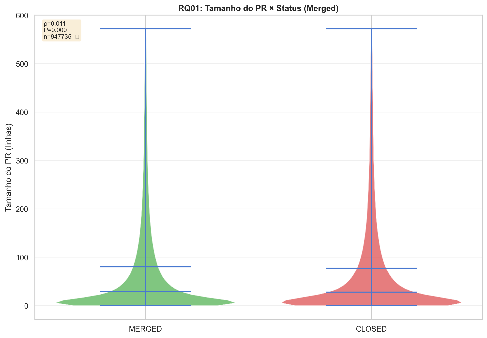

**Correlação de Spearman: ρ = 0.0109**

- **Magnitude:** Correlação positiva **muito fraca**, praticamente inexistente
- **Interpretação:** O tamanho do PR tem **impacto mínimo** na probabilidade de merge
- **Significado prático:** Embora estatisticamente significante, o efeito é negligível do ponto de vista prático

**RQ02: Tempo de Análise vs Feedback Final**

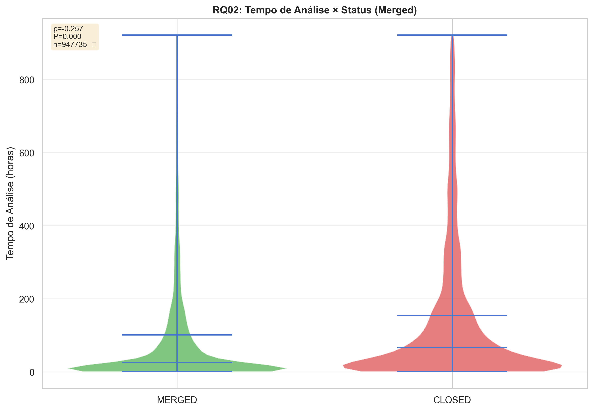

Correlação de Spearman: ρ = -0.2571

- **Magnitude:** Correlação negativa **fraca a moderada**
- **Interpretação:** Quanto maior o tempo de análise, **menor a probabilidade de merge**
- **Significado prático:** Esta é a correlação mais forte com o status de merge, indicando que PRs que levam muito tempo tendem a ser fechados sem merge

**RQ03: Descrição do PR vs Feedback Final**

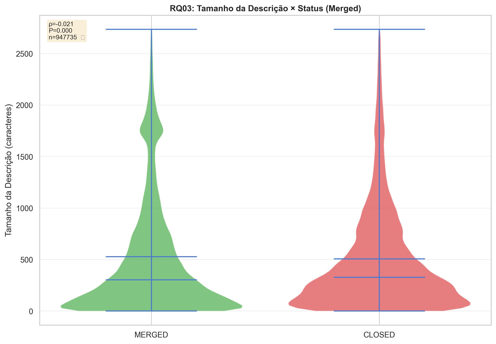

Correlação de Spearman: ρ = -0.0210

- **Magnitude:** Correlação negativa **muito fraca**
- **Interpretação:** Descrições mais longas têm **correlação negativa muito fraca** com merge
- **Significado prático:** O tamanho da descrição não é um fator relevante para aprovação

**RQ04: Interações vs Feedback Final**

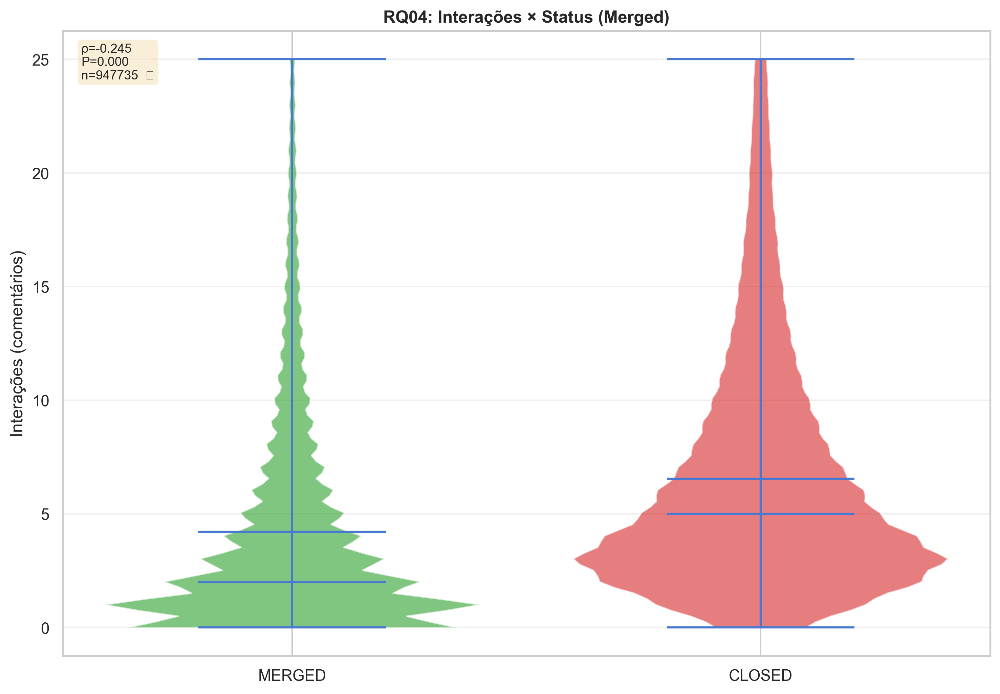

Correlação de Spearman: ρ = -0.2453

- **Magnitude:** Correlação negativa **fraca a moderada**
- **Interpretação:** Mais interações estão associadas a **menor probabilidade de merge**
- **Significado prático:** Interações extensivas indicam problemas ou discussões que podem levar à rejeição

**RQ05: Tamanho do PR vs Número de Revisões**

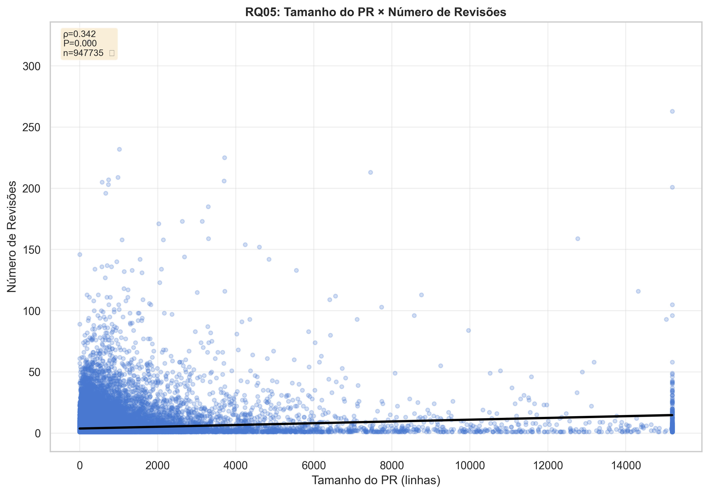

Correlação de Spearman: ρ = 0.3419

- **Magnitude:** Correlação positiva **moderada**
- **Interpretação:** PRs maiores recebem **mais revisões**
- **Significado prático:** Esta é uma correlação moderadamente forte, indicando que o tamanho influencia o processo de revisão

**RQ06: Tempo de Análise vs Número de Revisões**

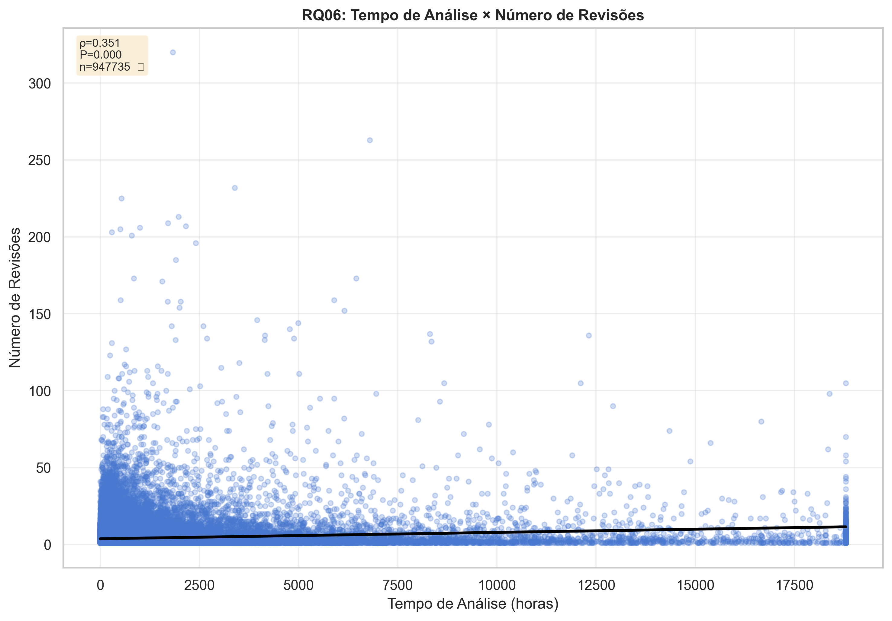

Correlação de Spearman: ρ = 0.3509

- **Magnitude:** Correlação positiva **moderada**
- **Interpretação:** Quanto maior o tempo de análise, **mais revisões** são realizadas
- **Significado prático:** Processos de revisão mais longos acumulam mais rodadas de feedback

**RQ07: Descrição do PR vs Número de Revisões**


Correlação de Spearman: ρ = 0.1291

- **Magnitude:** Correlação positiva **fraca**
- **Interpretação:** Descrições mais longas têm **leve associação** com mais revisões
- **Significado prático:** O tamanho da descrição tem impacto limitado no número de revisões

**RQ08: Interações vs Número de Revisões**

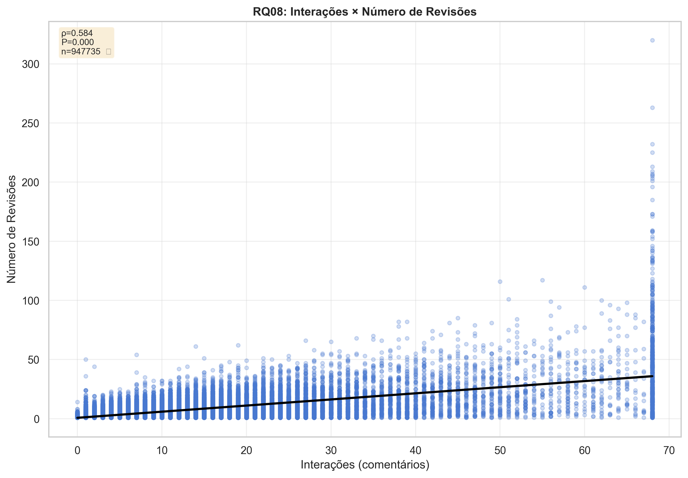

Correlação de Spearman: ρ = 0.5842

- **Magnitude:** Correlação positiva **forte**
- **Interpretação:** Esta é a **correlação mais forte** observada em todo o estudo
- **Significado prático:** Interações e revisões estão fortemente conectadas, formando um ciclo de feedback iterativo

## 5. Visualização

Geramos gráficos (dashboard, heatmap, barras, violin plots, scatter plots) para facilitar a interpretação dos resultados e evidenciar padrões e correlações relevantes.

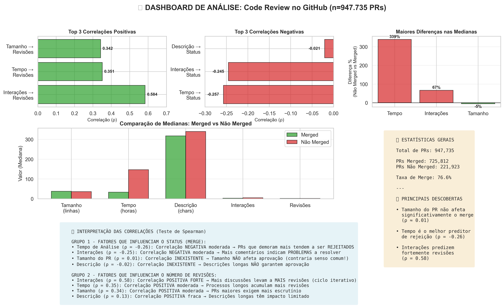

**Conteúdo:**

- Top 3 correlações positivas e negativas
- Diferenças percentuais nas medianas
- Comparação visual completa
- Estatísticas gerais

### Análise das Correlações

#### Grupo 1: Fatores que influenciam o status do PR (Merge)

| Variável Independente             | Correlação (ρ) | P-valor | Interpretação                    |
| --------------------------------- | -------------- | ------- | -------------------------------- |
| Tempo de análise                  | -0.2571        | < 0.001 | Moderada negativa (Significante) |
| Interações (fechamento ou merge). | -0.2453        | < 0.001 | Moderada negativa (Significante) |
| Tamanho da descrição              | -0.0210        | < 0.001 | Muito fraca                      |
| Tamanho do PR                     | 0.0109         | < 0.001 | Praticamente nula                |

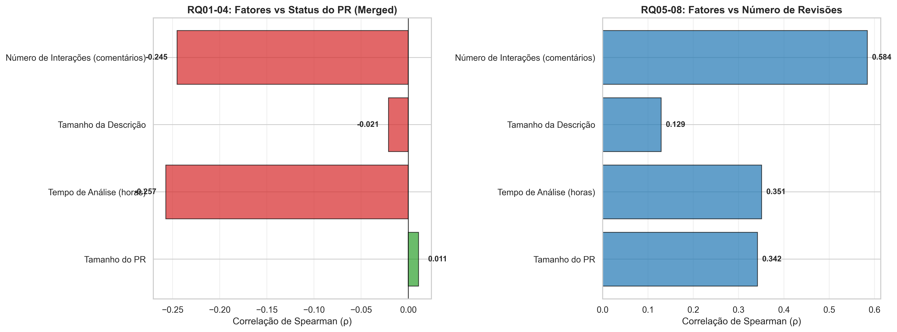

**Painéis:**

- Esquerda: RQ01-04 (Fatores → Status do PR)
- Direita: RQ05-08 (Fatores → Número de Revisões)

Como interpretar:

- Verde = correlação positiva
- Vermelho = correlação negativa

_<p style="text-align:center;">Comparação visual das correlações entre grupos de RQs</p>_

#### Grupo 2: Fatores que influenciam o número de revisões

| Variável Independente  | Correlação (ρ) | P-valor | Interpretação                    |
| ---------------------- | -------------- | ------- | -------------------------------- |
| Tempo de análise       | 0.5842         | < 0.001 | Forte positiva (Significante)    |
| Interações             | 0.3509         | < 0.001 | Moderada positiva (Significante) |
| (fechamento ou merge). |
| Tamanho da descrição   | 0.3419         | < 0.001 | Moderada positiva                |
| Tamanho do PR          | 0.1291         | < 0.001 | Fraca positiva                   |

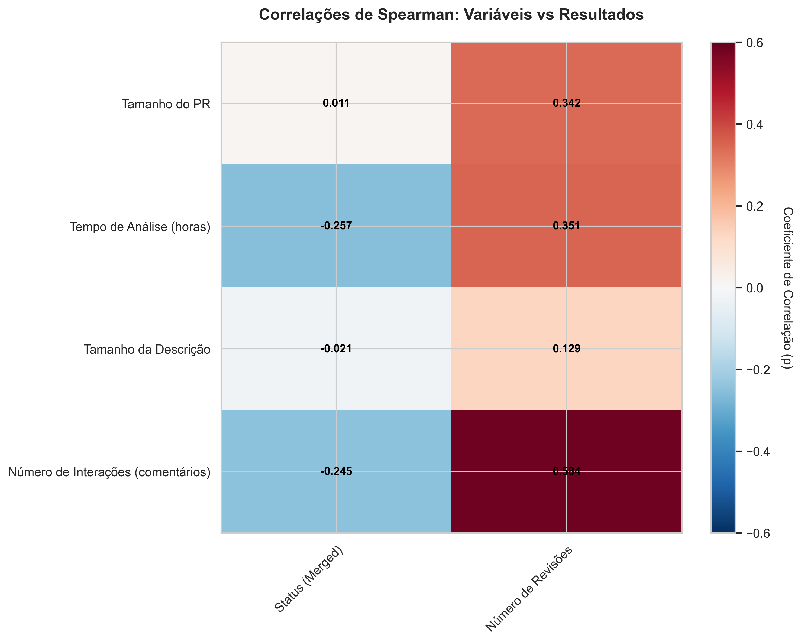

_<p style="text-align:center;">Heatmap mostrando todas as correlações de Spearman entre variáveis</p>_

**Eixos:**

- Linhas: Variáveis independentes (Tamanho, Tempo, Descrição, Interações)
- Colunas: Variáveis dependentes (Status, Número de Revisões)

Como interpretar:

- Vermelho = correlação negativa
- Azul = correlação positiva
- Intensidade = magnitude da correlação

### Estatísticas Descritivas

Diferenças Chave: PRs Mergeados vs Não Mergeados

- Tempo de Análise: PRs não mergeados levam 4.4x mais tempo (147h vs 33h)
- Interações: PRs não mergeados têm 67% mais comentários (5 vs 3)
- Tamanho do PR: Praticamente idêntico (36 vs 38 linhas)
- Descrição: PRs não mergeados têm descrições 7% mais longas (340 vs 318 chars)


_<p style="text-align:center;">Comparação das medianas entre PRs mergeadas e não mergeadas</p>_

**5 Painéis:**

- Tamanho do PR
- Tempo de Análise ⚠️ **MAIOR DIFERENÇA** (4.4x)
- Tamanho da Descrição
- Interações
- Número de Revisões

Como interpretar:

- Verde = Mergeado
- Vermelho = Não Mergeado

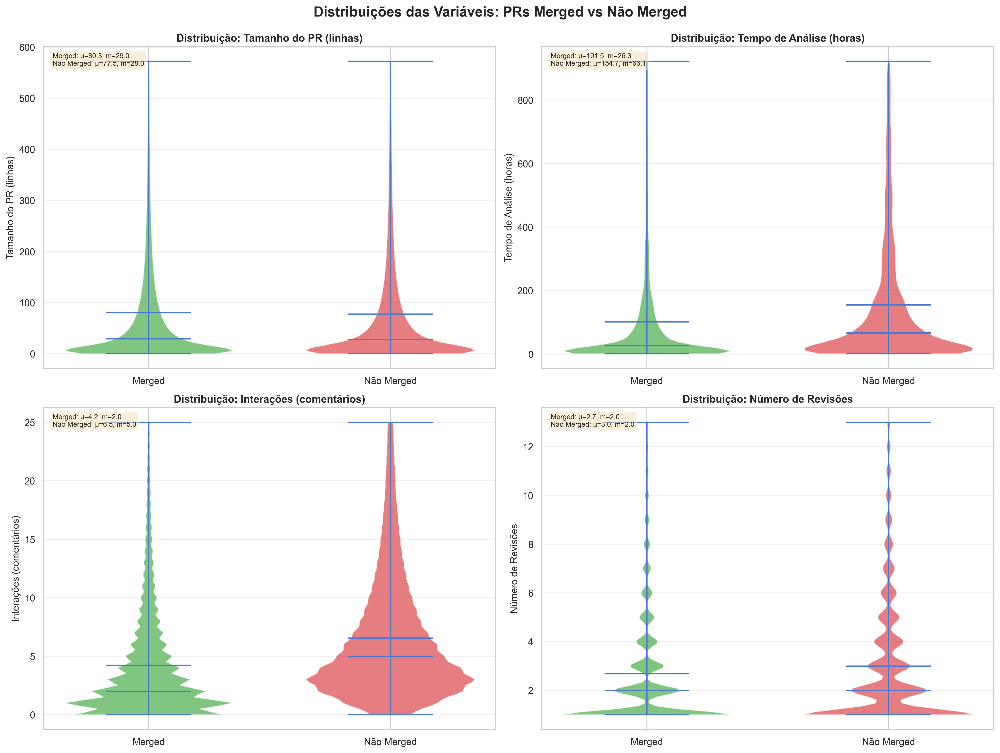

_<p style="text-align:center;">Distribuições completas das variáveis principais (violin plots)</p>_

**4 Variáveis:**

- Tamanho do PR
- Tempo de Análise
- Interações
- Número de Revisões

Como interpretar:

- Largura do violino = densidade
- Linha preta = mediana
- Linha pontilhada = média

### Relação Entre Variáveis

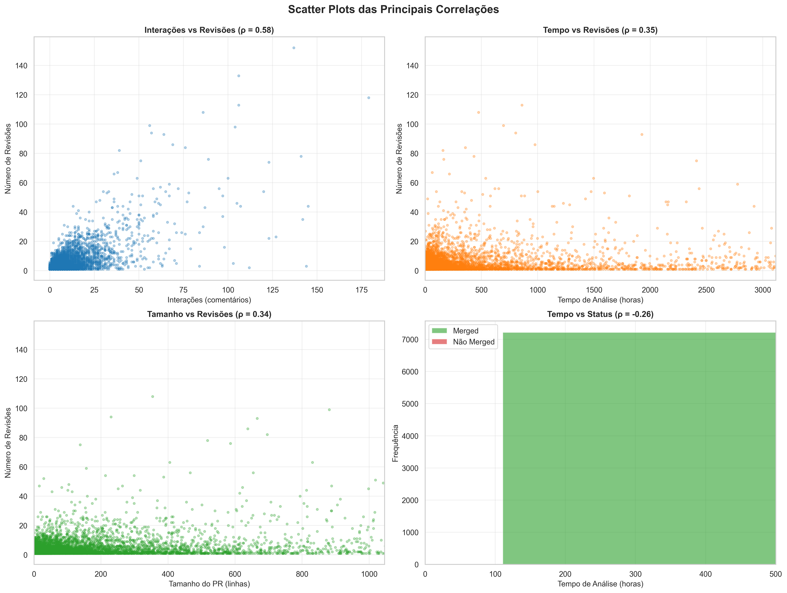

**4 Painéis:**

- **Interações × Revisões** (ρ = 0.58) ⭐ **Correlação mais forte**
- Tempo × Revisões (ρ = 0.35)
- Tamanho × Revisões (ρ = 0.34)
- Tempo × Status (histograma comparativo)

_<p style="text-align:center;">Scatter plots mostrando as principais correlações observadas</p>_

---

### 6. Resultados

A seguir, são apresentados os principais resultados obtidos a partir da análise dos repositórios e pull requests, utilizando as métricas definidas na metodologia.

### 6.1. Valores Brutos

| Métrica              |  Média | Mediana | Moda | Mínimo |       Máximo |        Variância | Desvio Padrão | Código |
| -------------------- | -----: | ------: | ---: | -----: | -----------: | ---------------: | ------------: | -----: |
| `additions`          | 721.25 |    24.0 |  1.0 |    0.0 | 13 366 477.0 | 1 761 543 612.12 |     41 970.75 |   LM01 |
| `bodyLength`         | 646.76 |   263.0 |  0.0 |    0.0 |    244 320.0 |     1 926 353.72 |      1 387.93 |   LM03 |
| `changedFiles`       |  13.23 |     2.0 |  1.0 |    0.0 |     81 477.0 |        77 488.56 |        278.37 |   LM01 |
| `deletions`          | 378.10 |     6.0 |  1.0 |    0.0 | 11 143 920.0 |   533 949 773.23 |     23 107.35 |   LM01 |
| `hoursOpen`          | 675.06 |    43.3 | 1.02 |    1.0 |   116 725.73 |     7 676 283.70 |      2 770.61 |   LM02 |
| `interactionsCount`  |   6.44 |     3.0 |  0.0 |    0.0 |      1 497.0 |           127.48 |         11.29 |   LM04 |
| `issueCommentsCount` |   4.42 |     2.0 |  0.0 |    0.0 |      1 497.0 |            60.23 |          7.76 |   AM02 |
| `reviewThreadsCount` |   2.02 |     0.0 |  0.0 |    0.0 |        421.0 |            38.44 |          6.20 |   AM01 |
| `reviewsCount`       |   3.97 |     2.0 |  1.0 |    1.0 |      1 686.0 |            57.80 |          7.60 |   LM05 |

Essas métricas descrevem a distribuição, variabilidade e escala de diferentes atributos dos PRs — como tamanho do código alterado, engajamento em revisões e tempo de vida do PR.

Há grande assimetria (skewness positiva) em praticamente todas as variáveis: médias muito maiores que as medianas, o que indica muitos valores pequenos e poucos valores extremamente altos (outliers).

No geral, o tamanho dos PRs é extremamente variável - a maioria é pequena, mas há poucos gigantes que distorcem a média. O engajamento é baixo na maioria dos casos, concentrando em poucos PRs muito discutidos. O tempo aberto também possui grande variação: PRs típicos fecham em 1-2 dias, mas há long tail de PRs abertos por muito tempo. Por fim, percebe-se uma alta proporção de PRs sem descrição, o que pode ser um possível problema de comunicação ou automação.

### 6.2 Discussão dos resultados

#### H1.1 - Tamanho do PR e Status (REFUTADA)

**Hipótese:** PRs maiores teriam menor taxa de aprovação  
**Resultado:** ρ = 0.0109 (correlação praticamente nula)

Surpreendentemente, o tamanho do PR **não tem impacto significativo** na probabilidade de merge. A mediana de PRs mergeados (38 linhas) é virtualmente idêntica à de PRs não mergeados (36 linhas). Isso contradiz a intuição de que PRs menores seriam mais facilmente aceitos.

- O que importa é a qualidade da mudança, não seu tamanho
- Em projetos maduros, mudanças grandes podem ser normais e bem aceitas quando necessárias
- Ferramentas modernas de code review facilitam a análise de PRs grandes
- PRs muito grandes podem ter sido filtrados antes da submissão

#### H1.2 - Tempo de Análise e Status (CONFIRMADA)

**Hipótese:** Maior tempo de análise levaria a menor taxa de merge  
**Resultado:** ρ = -0.2571 (correlação negativa moderada)

Esta hipótese foi **confirmada** com a correlação mais forte observada para o status de merge. A mediana de tempo para PRs não mergeados é **4.4x maior** (147h vs 33h).

- PRs que demoram muito provavelmente encontram problemas significativos
- Tempos longos podem indicar falta de consenso ou abandono
- É o **melhor preditor individual** do status de merge entre as variáveis analisadas

#### H1.3 - Descrição do PR e Status (REFUTADA)

**Hipótese:** Descrições mais longas levariam a maior taxa de aprovação  
**Resultado:** ρ = -0.0210 (correlação negativa muito fraca)

Contra nossa expectativa, descrições mais longas têm uma **correlação negativa** (embora mínima) com merge. PRs não mergeados têm descrições ligeiramente mais longas (340 vs 318 caracteres na mediana).

- Desenvolvedores podem escrever descrições longas para PRs problemáticos
- Descrições concisas podem ser mais efetivas que longas
- Descrições muito longas podem dificultar a revisão
- PRs complexos que tendem a ser rejeitados podem exigir descrições mais longas

#### H1.4 - Interações e Status (CONFIRMADA)

**Hipótese:** Mais interações levariam a menor taxa de merge  
**Resultado:** ρ = -0.2453 (correlação negativa moderada)

A hipótese foi **confirmada**. PRs não mergeados têm 67% mais interações (mediana de 5 vs 3). A correlação é a segunda mais forte para predição de status.

- Muitas interações frequentemente indicam **problemas a resolver**
- Discussões extensas podem sinalizar **falta de consenso**
- Não necessariamente significa má qualidade, mas indica **complexidade** do processo

#### H2.1 - Tamanho do PR e Número de Revisões (CONFIRMADA)

**Hipótese:** PRs maiores receberiam mais revisões  
**Resultado:** ρ = 0.3419 (correlação positiva moderada)

Hipótese **confirmada** com correlação moderada. PRs maiores naturalmente exigem mais escrutínio e rodadas de revisão.

- Desenvolvedores devem **esperar mais iterações** em PRs grandes
- Incentiva a prática de **dividir PRs grandes** em menores para agilizar o processo

#### H2.2 - Tempo de Análise e Número de Revisões (CONFIRMADA)

**Hipótese:** Maior tempo de análise levaria a mais revisões  
**Resultado:** ρ = 0.3509 (correlação positiva moderada)

Hipótese **confirmada**. Esta é a correlação positiva mais forte com número de revisões (exceto interações).

- Processos iterativos naturalmente **acumulam tempo e revisões**
- Cada revisão adiciona tempo ao processo, criando um **ciclo de feedback**

#### H2.3 - Descrição do PR e Número de Revisões (PARCIALMENTE CONFIRMADA)

**Hipótese:** Descrições longas teriam correlação fraca ou inexistente com revisões  
**Resultado:** ρ = 0.1291 (correlação positiva fraca)

A hipótese foi **parcialmente confirmada**. Há uma correlação positiva, mas fraca.

- Descrições mais longas podem indicar PRs mais **complexos** que necessitam mais revisões
- O efeito é limitado, sugerindo que a descrição não é fator determinante

#### H2.4 - Interações e Número de Revisões (CONFIRMADA FORTEMENTE)

**Hipótese:** Forte correlação positiva entre interações e revisões  
**Resultado:** ρ = 0.5842 (correlação positiva FORTE)

Esta é a **correlação mais forte** encontrada em todo o estudo. Hipótese **fortemente confirmada**.

- Interações e revisões formam um **ciclo iterativo natural**
- Cada revisão gera discussão, que leva a nova revisão
- É a **relação mais previsível** observada

### Principais Descobertas

1. **Tamanho não importa (para merge):** Contrariando a sabedoria convencional, o tamanho do PR tem impacto negligível na aprovação

2. **Tempo é o fator crítico:** O tempo de análise é o melhor preditor de rejeição (ρ = -0.26)

3. **Interações duplo-papel:** Interações predizem tanto rejeição (ρ = -0.25) quanto mais revisões (ρ = 0.58)

4. **Descrição superestimada:** O tamanho da descrição tem efeito mínimo em ambos os resultados

5. **Ciclo virtuoso/vicioso:** PRs entram em ciclos onde mais tempo → mais revisões → mais interações → menor chance de merge

### Limitações do Estudo

1. **Causalidade:** Correlações não implicam causalidade. Pode haver variáveis confundidoras não medidas.

2. **Heterogeneidade:** Diferentes projetos têm culturas de revisão diferentes, não capturadas na análise agregada.

3. **Métricas proxy:** "Interações" como comentários pode não capturar toda a complexidade do processo de revisão.

4. **Viés de seleção:** Repositórios populares podem não representar o desenvolvimento de software em geral.

5. **Dados temporais:** Não analisamos tendências temporais ou sazonalidade.

### Implicações Práticas

**Para Desenvolvedores:**

- Evite receio quanto ao tamanho dos PRs, uma vez que o volume de alterações não demonstrou impacto significativo na probabilidade de aprovação.
- Responda prontamente aos feedbacks recebidos, visto que períodos prolongados de resposta estão associados a maiores taxas de rejeição.
- Reduza interações excessivas durante a revisão, pois um número elevado de discussões tende a correlacionar-se com a rejeição do PR.
- Mantenha descrições objetivas e claras, já que textos longos não se mostraram substancialmente mais eficazes do que descrições concisas.

**Para Revisores:**

- Priorize a agilidade no retorno das revisões, considerando que tempos de resposta longos frequentemente resultam em abandono ou rejeição de PRs.
- Foque na qualidade técnica do código, evitando utilizar o tamanho do PR como critério principal de avaliação.
- Busque reduzir o número de iterações de revisão, uma vez que cada rodada adicional diminui a probabilidade de aceitação final.

**Para Projetos e Equipes de Manutenção:**

- Monitore o tempo médio de análise de PRs como um indicador relevante da eficiência e saúde do processo de revisão.
- Implemente mecanismos automatizados de apoio à revisão, de modo a otimizar o tempo de feedback e aumentar a consistência nas análises.
- Defina Acordos de Nível de Serviço (SLAs) para o tempo máximo de resposta dos revisores, promovendo previsibilidade e engajamento.
- Acompanhe PRs com volume elevado de interações, pois podem sinalizar conflitos de comunicação ou necessidade de mediação técnica.

### 6. Conclusão

Este estudo analisou 947.735 Pull Requests para identificar fatores que influenciam o sucesso e a eficiência do processo de code review. Utilizando o coeficiente de correlação de Spearman, encontramos evidências que desafiam algumas crenças comuns:

**Principais Conclusões:**

1. O tamanho do PR não é um fator significativo para aprovação (ρ = 0.01), contrariando a sabedoria convencional de que "PRs menores são sempre melhores".
2. O tempo de análise é o preditor mais importante de rejeição (ρ = -0.26), sugerindo que feedback rápido é crucial. PRs analisados por mais tempo tendem a ser rejeitados ou abandonados.
3. Interações têm papel ambíguo: predizem tanto rejeição (ρ = -0.25) quanto mais revisões (ρ = 0.58), indicando que discussões extensas podem ser tanto problemáticas quanto parte natural de processos iterativos.
4. Descrições longas não garantem aprovação (ρ = -0.02), sugerindo que qualidade supera quantidade, mas podem facilitar revisões mais rápidas.
5. O número de revisões é fortemente influenciado por interações (ρ = 0.58), tamanho (ρ = 0.34) e tempo (ρ = 0.35).
6. Métricas de popularidade dos repositórios (estrelas, forks) não explicam diretamente o sucesso dos PRs.

Limitações enfrentadas incluíram restrições da API do GitHub, normalização de dados e tratamento de outliers. Para trabalhos futuros, recomenda-se aprofundar a análise de correlações, explorar métricas de qualidade de código e implementar dashboards interativos.

Este trabalho contribuiu para a literatura de engenharia de software empírica ao fornecer evidências quantitativas sobre práticas de code review em larga escala, utilizando métodos estatísticos robustos e uma amostra significativa.

O conjunto de scripts, dados e gráficos gerados está disponível para consulta e pode ser adaptado para novas investigações sobre processos colaborativos em projetos open source.

- Use o `summary_dashboard.png` para uma visão geral rápida.
- Utilize `correlation_heatmap.png` e `correlation_bars.png` para discutir relações entre variáveis.
- Apresente `descriptive_comparison.png` para destacar diferenças entre PRs aprovados e rejeitados.
- Mostre `distributions.png` para ilustrar a dispersão dos dados.
- Use `scatter_correlations.png` para evidenciar padrões e tendências específicas.

Todos os gráficos estão disponíveis em `docs/charts/`.

---

## 7. Referências

Liste as referências bibliográficas ou links utilizados.

- [📌 GitHub API Documentation](https://docs.github.com/en/graphql)
- [📌 Biblioteca Pandas](https://pandas.pydata.org/)

---

## 8. Apêndices

Todos os dados, scripts e análises estão disponíveis no repositório:

- **Código de coleta:** `code/collector.py`
- **Código de sumarização**: `code/summarizer.py`
- **Código de análise:** `code/analyzer.py`
- **Dados brutos:** `code/datasets/`
- **Resultados:** `code/results/`

### 8.1. Configuração

1. Gere seu token em  
   `Settings > Developer Settings > Personal Access Tokens`
2. Exporte o token como variável de ambiente:
   ```bash
   export GITHUB_TOKEN=seu_token_aqui
   ```
3. Instale as dependências:
   ```bash
   pip install -r requirements.txt
   ```
4. Execute o script:
   ```bash
   cd code
   python collector.py
   python summarizer.py
   python analyzer.py
   ```

---

**Documento gerado em:** 16 de Outubro de 2025  
**Total de PRs analisados:** 947.735  
**Método estatístico:** Correlação de Spearman  
**Nível de significância:** α = 0.05

---
